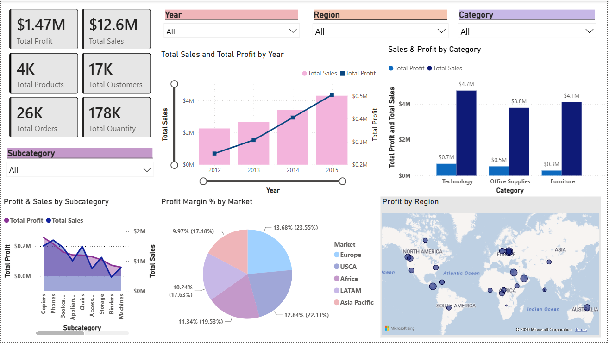
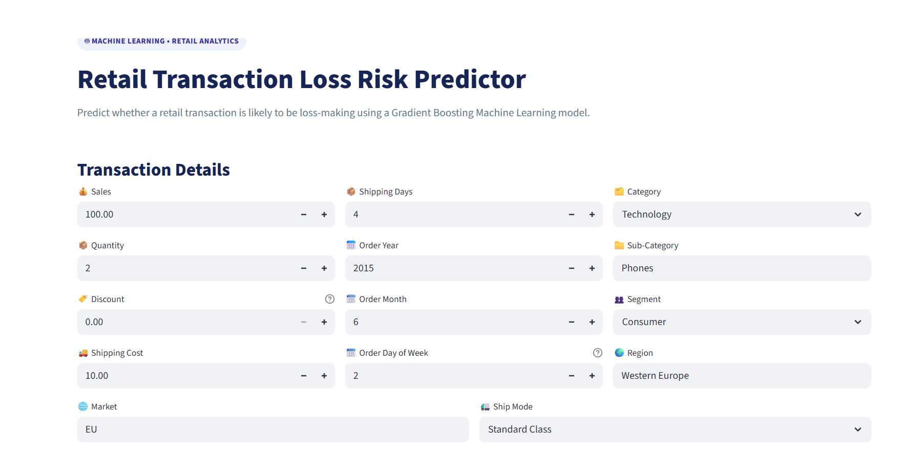
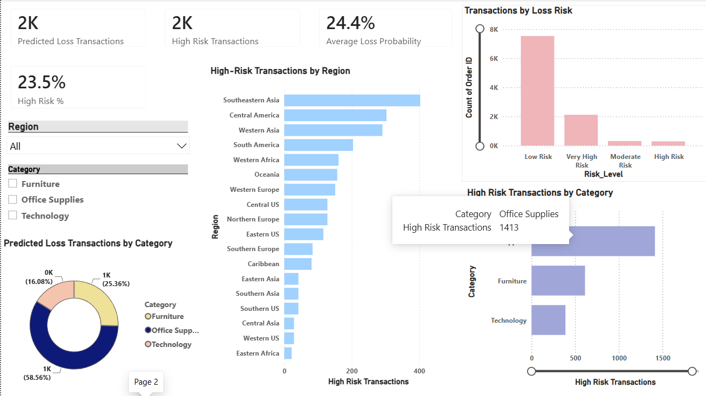

# 🛒 Retail Analytics Platform

An end-to-end **Retail Analytics and Machine Learning project** that combines **SQL, Data Analysis, Exploratory Data Analysis (EDA), Business Intelligence, and Machine Learning** to analyze retail transactions and predict transaction-level loss risk.

---

## 📌 Project Overview

The **Retail Analytics Platform** analyzes retail transaction data to identify:

- Sales and profitability patterns
- Loss-making transactions
- Product performance
- Regional profitability
- Discount impact
- Shipping-related factors
- Factors influencing transaction losses

The project covers the complete data analytics lifecycle:

- Data Cleaning
- Data Profiling
- Data Quality Assessment
- ETL
- SQL Analysis
- Exploratory Data Analysis
- Power BI Dashboard
- Machine Learning
- Model Evaluation
- Feature Importance Analysis
- Model Deployment using Streamlit

The final Machine Learning application predicts whether a retail transaction is likely to be **profitable or loss-making**.

---

## 🎯 Business Problem

Retail businesses can generate high sales while still experiencing losses because of factors such as:

- Excessive discounts
- High shipping costs
- Poor-performing products
- Regional profitability differences
- Product-category performance
- Inefficient shipping strategies

The objective of this project is to analyze these factors and develop a Machine Learning model that can identify transactions with a high probability of resulting in a loss.

---

## 💡 Project Objectives

1. Analyze retail transaction data.
2. Clean and prepare the dataset.
3. Perform data profiling and quality assessment.
4. Perform business analysis using SQL Server.
5. Build interactive Power BI dashboards.
6. Perform Exploratory Data Analysis using Python.
7. Identify major profitability drivers.
8. Identify strong, weak, problem, and opportunity products.
9. Build a classification model for loss prediction.
10. Compare multiple Machine Learning algorithms.
11. Optimize the classification threshold.
12. Identify the most influential features.
13. Deploy the final model using Streamlit.
14. Convert analytical findings into actionable business recommendations.

---

# 🏗️ Project Architecture

```text
                    RETAIL DATA
                         │
                         ▼
                Data Cleaning & ETL
                         │
                         ▼
                  Data Profiling
                         │
                         ▼
                 SQL Server Analysis
                         │
              ┌──────────┴──────────┐
              ▼                     ▼
             EDA                Power BI
              │                  Dashboard
              │
              ▼
       Feature Engineering
              │
              ▼
       Machine Learning Models
              │
              ▼
       Model Evaluation
              │
              ▼
       Gradient Boosting Model
              │
              ▼
      Threshold Optimization
              │
              ▼
      Streamlit Model Deployment
              │
              ▼
       Business Risk Prediction
```


# 🧹 Data Preparation

The data preparation stage included:

- Data cleaning
- Missing-value analysis
- Duplicate checking
- Data-type validation
- Column standardization
- Feature creation
- ETL processing
- Preparation of data for SQL analysis
- Preparation of data for Machine Learning

---

# 🔍 Data Profiling

Data profiling was performed to understand the structure and characteristics of the dataset.

The analysis included:

- Number of records
- Number of features
- Data types
- Missing values
- Unique values
- Numerical distributions
- Categorical variables
- Potential data-quality issues

### Dataset Overview

| Attribute | Value |
|---|---:|
| Records | 51,290 |
| Columns | 24 |
| Products | 3,788 |
| Customers | 17,415 |
| Orders | 25,728 |

---

# 🛠️ Data Quality Assessment

The data-quality assessment focused on:

- Missing values
- Duplicate records
- Invalid values
- Data-type inconsistencies
- Outliers
- Data inconsistencies

The cleaned dataset was then used for SQL, EDA, Power BI, and Machine Learning.

---

# 🔄 ETL Process

The ETL workflow was used to transform the raw retail data into analysis-ready tables.

```text
Raw Excel / Source Files
          │
          ▼
       Extract
          │
          ▼
      Transform
          │
          ├── Cleaning
          ├── Standardization
          ├── Data Validation
          ├── Missing Value Handling
          └── Feature Preparation
          │
          ▼
        Load
          │
          ▼
   SQL Server / Analysis Tables
```

The ETL process helped prepare consistent data for downstream SQL analysis, Power BI reporting, EDA, and Machine Learning.

---

# 🗄️ SQL Analysis

SQL Server was used to perform structured business analysis of the retail dataset.

The SQL workflow included:

- Database creation
- Table creation
- Data importing
- Database relationships
- Data validation
- Aggregations
- Filtering
- Grouping
- Sorting
- Business-oriented analytical queries

### SQL Analysis Areas

- Sales analysis
- Profit analysis
- Product analysis
- Category analysis
- Customer analysis
- Regional analysis
- Discount analysis
- Shipping analysis
- Loss analysis

The SQL scripts are available in:

```text
SQL/
```

---

# 📊 Power BI Dashboard

Power BI was used to build interactive dashboards for retail sales and profitability analysis.

The dashboard provides insights into:

- Sales
- Profit
- Profitability
- Product performance
- Category performance
- Regional performance
- Customer segments
- Shipping performance
- Discount impact

### Dashboard Features

- KPI cards
- Interactive filters
- Category analysis
- Regional analysis
- Product analysis
- Profitability trends
- Business performance analysis

### Dashboard Preview




---

# 📊 Exploratory Data Analysis

Exploratory Data Analysis was performed using Python to understand relationships between:

- Sales
- Profit
- Discount
- Products
- Categories
- Regions
- Shipping
- Transactions

The EDA stage helped identify important business patterns and supported the Machine Learning feature-selection process.

---

# 📉 Discount × Category × Profit

The analysis showed a strong relationship between **discount levels and profit margins**.

Higher discount levels generally resulted in progressively lower profit margins and, in many cases, negative profitability.

### Example: Furniture

| Discount Band | Profit Margin |
|---|---:|
| 0–10% | 22.18% |
| 11–20% | 4.62% |
| 21–30% | -6.18% |
| 31–40% | -25.40% |
| 41–50% | -48.22% |
| 51–60% | -81.43% |
| 61–70% | -146.09% |
| 71–85% | -259.42% |

### Business Insight

> **Excessive discounting is strongly associated with declining profitability.**

---

# 🌎 Discount × Region × Profit

Regional analysis showed that several regions experienced significant losses at high discount levels.

Examples include:

- Western Europe – 71–85% discount
- Northern Europe – 71–85% discount
- Southern Asia – 71–85% discount
- Central US – 71–85% discount
- Western Africa – 61–70% discount
- Western Asia – 61–70% discount

### Business Insight

> **Discount strategies should be evaluated at a regional level rather than applying a single strategy across all markets.**

---

# 📦 Product Analysis

Products were analyzed using:

- Total Quantity
- Total Sales
- Total Profit
- Profit Margin
- Category
- Sub-Category

Products were segmented into four groups:

```text
Strong Products
Weak Products
Problem Products
Hidden Opportunities
```

---

### Business Insight

> Strong products combine strong sales performance with positive profitability and can be prioritized for growth and inventory planning.

---

### Business Insight

> Problem products should be reviewed for pricing, discounting, shipping costs, demand, inventory, or possible discontinuation.

---


### Business Insight

> Hidden opportunities may have strong profitability despite lower sales and could benefit from targeted marketing and increased visibility.

---

# 📉 Loss Analysis

A binary target variable was created:

```text
Is_Loss

0 → Profitable Transaction
1 → Loss-Making Transaction
```

### Transaction Distribution

| Transaction Type | Count | Percentage |
|---|---:|---:|
| Profitable | 38,746 | 75.54% |
| Loss-Making | 12,544 | 24.46% |

Approximately one-quarter of the transactions were loss-making.

---

# 🤖 Machine Learning

The Machine Learning problem was formulated as a **binary classification task**.

### Target Variable

```text
Is_Loss
```

| Value | Meaning |
|---:|---|
| 0 | Profitable |
| 1 | Loss |

---

# 📌 Features Used

The model used transaction, product, customer, regional, and shipping-related features including:

- Sales
- Quantity
- Discount
- Shipping Cost
- Shipping Days
- Order Year
- Order Month
- Order Day of Week
- Category
- Sub-Category
- Segment
- Region
- Market
- Ship Mode
- Order Priority

---

# ✂️ Train-Test Split

The dataset was divided using an **80:20 train-test split**.

```text
Training Set : 41,032 records
Testing Set  : 10,258 records
```

Stratified splitting was used to preserve the class distribution.

---

# 🧪 Model Comparison

Four classification models were evaluated:

1. Logistic Regression
2. Decision Tree
3. Random Forest
4. Gradient Boosting

| Model | Accuracy | Precision | Recall | F1 Score | ROC-AUC |
|---|---:|---:|---:|---:|---:|
| Logistic Regression | 92.70% | 89.64% | 79.31% | 84.16% | 97.54% |
| Decision Tree | 92.49% | 88.77% | 79.35% | 83.80% | 96.80% |
| Random Forest | 92.85% | 90.99% | 78.56% | 84.32% | 97.55% |
| **Gradient Boosting** | **92.77%** | **90.03%** | **79.23%** | **84.29%** | **97.80%** |

---

# 🏆 Final Model — Gradient Boosting

**Gradient Boosting Classifier** was selected as the final model because it achieved the highest ROC-AUC among the evaluated models.

### Initial Model Performance

| Metric | Score |
|---|---:|
| Accuracy | 92.77% |
| Precision | 90.03% |
| Recall | 79.23% |
| F1 Score | 84.29% |
| ROC-AUC | **97.80%** |

---

# 🎚️ Threshold Optimization

Different classification thresholds were evaluated to balance precision and recall.

| Threshold | Precision | Recall | F1 Score | False Negatives |
|---:|---:|---:|---:|---:|
| 0.30 | 80.06% | 87.68% | 84.02% | 309 |
| 0.35 | 84.25% | 85.10% | 84.67% | 374 |
| **0.40** | **86.61%** | **83.30%** | **84.92%** | **419** |
| 0.45 | 88.97% | 80.70% | 84.64% | 484 |
| 0.50 | 90.03% | 79.23% | 84.29% | 521 |

A threshold of **0.40** was selected for the final deployed model because it provided the highest F1 score among the tested thresholds while improving loss detection compared with the default threshold.

---

# 📊 Final Model Performance

| Metric | Score |
|---|---:|
| Accuracy | **92.77%** |
| Precision | **86.61%** |
| Recall | **83.30%** |
| F1 Score | **84.92%** |


---

# 🎯 Feature Importance

Gradient Boosting feature importance showed that **Discount** was by far the most influential feature.

| Feature | Importance |
|---|---:|
| Discount | 0.973035 |
| Market_USCA | 0.010976 |
| Sub-Category_Storage | 0.004005 |
| Sales | 0.003365 |
| Region_Southeastern Asia | 0.002449 |
| Market_LATAM | 0.002053 |
| Shipping Cost | 0.000835 |
| Sub-Category_Binders | 0.000678 |
| Sub-Category_Paper | 0.000604 |
| Region_Western US | 0.000296 |

### Key Finding

> **Discount is the dominant predictive feature in the Gradient Boosting model.**

This supports the EDA finding that excessive discounting is strongly associated with transaction losses.

---

# 🔄 Permutation Feature Importance

Permutation importance was also used to evaluate the effect of the original features on the model's F1 score.

| Feature | Mean Importance |
|---|---:|
| Discount | 0.611955 |
| Market | 0.000481 |
| Shipping Cost | 0.000469 |
| Ship Mode | 0.000437 |
| Category | 0.000276 |
| Order Year | 0.000268 |
| Order Day of Week | 0.000205 |
| Order Priority | 0.000022 |
| Segment | 0.000000 |
| Order Month | 0.000000 |
| Quantity | -0.000076 |
| Sales | -0.000252 |
| Shipping Days | -0.000379 |
| Sub-Category | -0.000549 |
| Region | -0.003987 |

### Key Insight

> Permutation importance further confirms that **Discount is the dominant feature influencing model performance**.

---

# 🚀 Model Deployment

The final Gradient Boosting model was deployed using **Streamlit**.

The application allows users to enter transaction information and receive a loss-risk prediction.

### Input Features

- Sales
- Quantity
- Discount
- Shipping Cost
- Shipping Days
- Order Year
- Order Month
- Order Day of Week
- Category
- Sub-Category
- Segment
- Region
- Market
- Ship Mode
- Order Priority

---

# 🖥️ Streamlit Application

The application follows this workflow:

```text
Transaction Details
        ↓
Feature Processing
        ↓
Gradient Boosting Model
        ↓
Loss Probability
        ↓
Loss-Risk Classification
        ↓
Business Recommendation
```

The application displays:

- Probability of Loss
- Risk Level
- Prediction
- Classification Threshold
- Business Recommendation
- AI Insight

### Example Prediction

```text
Probability of Loss: 0.16%

Prediction:
Low Loss Risk — This transaction is predicted to be profitable.

Classification Threshold: 40%
```

---

# 📸 Application Screenshots

## Model Deployment



## Prediction Result


---

# 📊 Power BI Dashboard

Power BI was used to create interactive dashboards for retail sales and profitability analysis.

The dashboard focuses on:

- Sales
- Profit
- Product performance
- Regional performance
- Category performance
- Customer segments
- Shipping performance
- Business trends

## Dashboard Preview



---

# 🛠️ Technologies Used

| Category | Technologies |
|---|---|
| Programming | Python |
| Data Analysis | Pandas, NumPy |
| Data Visualization | Matplotlib, Seaborn |
| Database | SQL Server |
| Business Intelligence | Power BI |
| Machine Learning | Scikit-learn |
| Deployment | Streamlit |
| Model Serialization | Joblib |
| Development | Jupyter Notebook |
| Version Control | Git, GitHub |

---

# 📁 Important Project Files

| File | Description |
|---|---|
| `Model_Deployment/app.py` | Streamlit deployment application |
| `Model_Deployment/gradient_boosting_loss_model.pkl` | Trained Gradient Boosting model |
| `Model_Deployment/feature_config.pkl` | Feature configuration used by the model |
| `Model_Deployment/requirements.txt` | Python dependencies |
| `Notebook/Machine learning.ipynb` | Machine Learning workflow |
| `Notebook/Data cleaning.ipynb` | Data cleaning process |
| `Notebook/Data profiling.ipynb` | Data profiling analysis |
| `Notebook/ETL.ipynb` | ETL workflow |
| `Dashboard/Dashboard.pbix` | Power BI dashboard |
| `SQL/Analytical_sql_queries.sql` | Analytical SQL queries |
| `SQL/Table creation.sql` | Database table creation |
| `reports/EDA.md` | EDA findings |
| `reports/Business_Conclusion.md` | Business conclusions |

---

# ▶️ How to Run the Project

## 1. Clone the Repository

```bash
git clone https://github.com/mankitha0606-lgtm/Retail-Analytics-Platform.git
```

```bash
cd Retail-Analytics-Platform
```

## 2. Create a Virtual Environment

```bash
python -m venv venv
```

### Windows

```bash
venv\Scripts\activate
```

## 3. Install Dependencies

```bash
pip install -r Model_Deployment/requirements.txt
```

## 4. Run the Streamlit Application

```bash
streamlit run Model_Deployment/app.py
```

The application will open in your browser.

---

# 🔐 Security

Sensitive information should **never** be committed to GitHub.

Do not upload:

- API keys
- Passwords
- Database credentials
- `.env` files
- `secrets.toml`
- Private credentials

These should be excluded using `.gitignore`.

---

# 📈 Business Recommendations

## 1. Control Excessive Discounts

Discount is the strongest factor associated with transaction loss.

Businesses should establish discount limits based on:

- Product
- Category
- Region
- Market

## 2. Monitor High-Discount Transactions

Transactions involving high discounts should receive additional review before completion.

## 3. Review Problem Products

Products with negative profitability should be evaluated for:

- Pricing
- Discounting
- Shipping costs
- Demand
- Inventory strategy

## 4. Promote Hidden Opportunities

Products with positive profitability but lower sales can be targeted through:

- Marketing campaigns
- Product recommendations
- Better visibility
- Bundling strategies

## 5. Apply Regional Pricing Strategies

Regional profitability varies significantly, so pricing and discount strategies should be adapted to individual markets.

## 6. Use Predictive Analytics

The deployed Machine Learning model can help identify potentially loss-making transactions before they negatively affect profitability.

---

# 🎓 Key Learning Outcomes

This project provided practical experience in:

- Data Cleaning
- Data Profiling
- Data Quality Assessment
- ETL
- SQL Analytics
- Exploratory Data Analysis
- Business Intelligence
- Feature Engineering
- Binary Classification
- Model Comparison
- Model Evaluation
- Threshold Optimization
- Feature Importance
- Machine Learning Deployment
- Streamlit Development
- Git & GitHub

---

# 🏁 Conclusion

The **Retail Analytics Platform** demonstrates an end-to-end approach to solving a real-world retail profitability problem.

The analysis identified **Discount as the most influential factor associated with transaction losses**.

Multiple Machine Learning models were evaluated, with **Gradient Boosting achieving the highest ROC-AUC of 97.80%**.

After threshold optimization, the final deployed model achieved:

| Metric | Score |
|---|---:|
| Accuracy | **92.77%** |
| Precision | **86.61%** |
| Recall | **83.30%** |
| F1 Score | **84.92%** |

The final Streamlit application transforms the analytical and Machine Learning workflow into an interactive business tool capable of predicting transaction-level loss risk.

---

# 👩‍💻 Author

## M Ankitha

**Data Science & Machine Learning Enthusiast**

### Areas of Interest

- Data Analytics
- Machine Learning
- Business Intelligence
- Artificial Intelligence
- Data-Driven Solutions

---

⭐ **If you found this project useful, consider giving the repository a star!**
